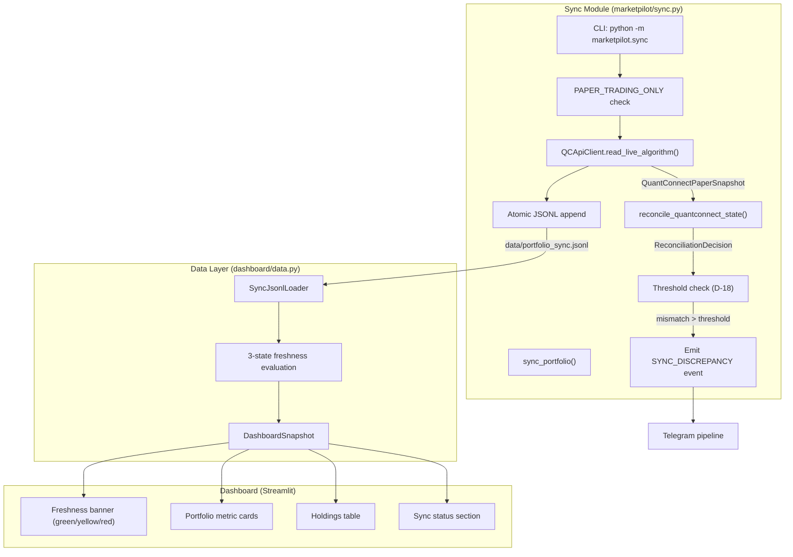

# Phase 14: Data Sync & Dashboard Integration - Research

**Researched:** 2026-06-16
**Domain:** Portfolio synchronization (QC REST → local JSONL) + Streamlit freshness display
**Confidence:** HIGH

## Summary

Phase 14 builds a sync module that polls QuantConnect Cloud via the existing `QCApiClient.read_live_algorithm()`, persists each snapshot as an append-only JSONL record with generation counters and atomic writes, runs reconciliation, and fires alerts on discrepancy. The dashboard side extends the existing Streamlit Portfolio page to read the latest JSONL line and display freshness-aware portfolio data with three states (FRESH/STALE/ERROR).

The codebase already contains 90% of the building blocks: `QCApiClient` with typed `QuantConnectPaperSnapshot` responses, `reconcile_quantconnect_state()` with mismatch detection and system event emission, `AppendOnlyJsonlAuditJournal` as a JSONL pattern reference, `DashboardFreshnessStatus` enum (needs third state), and the Streamlit dashboard shell with page registry and tab-based rendering.

**Primary recommendation:** Implement the sync module as a thin orchestration layer (`marketpilot/sync.py`) that composes existing client, reconciliation, and notification components — then add a JSONL-based `data_source_kind = "sync_jsonl"` loader in the dashboard data layer with 3-state freshness evaluation.

<user_constraints>

## User Constraints (from CONTEXT.md)

### Locked Decisions
- D-01: JSONL append-only at `data/portfolio_sync.jsonl`, each poll = 1 JSON line
- D-02: Dashboard reads last line for latest state
- D-03: Historical records serve debugging/audit (rotation out of scope)
- D-04: Atomic writes via temp-file-then-rename
- D-05: Monotonic generation counter; lower-than-expected = ERROR state
- D-06: Sync module is callable (not daemon); Phase 16 schedules
- D-07: CLI entrypoint: `python -m marketpilot.sync` for manual trigger
- D-08: ~5 min cadence target; sync module does not enforce timing
- D-09: Three freshness states: FRESH (≤10min), STALE (10-30min), ERROR (>30min)
- D-10: Freshness from `source_timestamp` vs wall-clock
- D-11: UTC internally, ET at display boundaries
- D-12: Extend existing Portfolio page (not new page)
- D-13: Display: freshness banner, portfolio metrics, holdings table, sync status
- D-14: Empty JSONL → "No sync data available" (never fabricate)
- D-15: QC labeled as authoritative in dashboard UI
- D-16: Each sync runs `reconcile_quantconnect_state()`
- D-17: Reconciliation detects but never auto-corrects
- D-18: ORDER/FILL mismatch = always alert; CASH/HOLDINGS only if >1% equity
- D-19: QC is authoritative (prior decision)
- D-20: All 454 tests must pass; new modules use lazy imports
- D-21: `PAPER_TRADING_ONLY` validated on initialization

### Agent's Discretion
- Internal module structure within `marketpilot/sync.py`
- JSONL record schema details (as long as it includes snapshot + metadata)
- How to integrate 3-state freshness into existing `DashboardFreshnessStatus` enum
- Streamlit widget choices for display elements

### Deferred Ideas (OUT OF SCOPE)
- Historical sync analytics (trend of equity over time)
- JSONL rotation/compaction policy
- WebSocket streaming from QC

</user_constraints>

<phase_requirements>

## Phase Requirements

| ID | Description | Research Support |
|----|-------------|------------------|
| SYNC-01 | Periodically poll QC /live/read for portfolio state | `QCApiClient.read_live_algorithm()` already returns typed `QuantConnectPaperSnapshot` — sync module wraps this call |
| SYNC-02 | Compare local mirror against QC using structured diff | `reconcile_quantconnect_state()` already performs structured comparison with typed mismatches |
| SYNC-03 | Discrepancies above threshold trigger SYNC_DISCREPANCY alert via Telegram | `event_for_system_incident()` + existing Telegram pipeline; threshold logic per D-18 |
| SYNC-04 | Reconciliation detects drift but never auto-corrects | Already enforced by `ReconciliationDecision` contract — sync module preserves this |
| SYNC-05 | Atomic sync with generation counters; partial syncs don't corrupt | Temp+rename pattern (D-04) + monotonic counter (D-05) in JSONL records |
| SYNC-06 | All local records carry staleness TTL; consumers check freshness | 3-state freshness evaluation from `source_timestamp` age (D-09/D-10) |
| DASH-01 | Dashboard refreshes ~5 min during market hours | Sync module callable on schedule (D-06/D-08); dashboard reads latest JSONL line |
| DASH-02 | Data >10 min shows stale-data warning | STALE state (yellow) in freshness banner per D-09 |
| DASH-03 | Data >30 min shows strong stale/error state | ERROR state (red) in freshness banner per D-09 |
| DASH-04 | Dashboard never fabricates missing data; QC authoritative | Empty file → informational message (D-14); authority label (D-15) |
| DASH-05 | Dashboard displays sync status, last sync time, freshness indicator | Sync status section with last_poll, next_expected, error_count per D-13 |
| SAFE-04 | All timestamps UTC internally; ET at display boundaries | UTC in JSONL records; `zoneinfo` ET conversion at Streamlit render layer only |

</phase_requirements>

## Architectural Responsibility Map

| Capability | Primary Tier | Secondary Tier | Rationale |
|------------|-------------|----------------|-----------|
| QC API polling | Backend (sync module) | — | Network I/O + auth lives in `marketpilot/` |
| Reconciliation | Backend (sync module) | — | Business logic comparing QC vs local state |
| JSONL persistence | Backend (sync module) | — | File I/O with atomicity guarantees |
| Freshness evaluation | Backend (data loader) | Frontend (display) | Calculation in Python; color-coding in Streamlit |
| Alert emission | Backend (sync module) | — | Telegram pipeline already in `marketpilot/` |
| Dashboard display | Frontend (Streamlit) | Backend (data loader) | Streamlit renders; data layer parses JSONL |
| Timezone conversion | Frontend (Streamlit) | — | UTC→ET only at display boundary |

## Standard Stack

### Core
| Library | Version | Purpose | Why Standard |
|---------|---------|---------|--------------|
| Python stdlib `json` | 3.11+ | JSONL serialization | No external dependency needed for simple line-delimited JSON |
| Python stdlib `tempfile` | 3.11+ | Atomic write via NamedTemporaryFile | OS-level temp file for crash-safe rename |
| Python stdlib `pathlib` | 3.11+ | Path manipulation | Already used throughout codebase |
| Python stdlib `zoneinfo` | 3.11+ | UTC→ET timezone conversion | Standard library replacement for pytz since 3.9 |
| `streamlit` | ≥1.51,<2 | Dashboard UI components | Already in project dependencies |
| `tenacity` | ≥9.0.0 | Retry on QC API transient errors | Already in project dependencies; used by `qc_api.py` |

### Supporting
| Library | Version | Purpose | When to Use |
|---------|---------|---------|-------------|
| `dataclasses` (stdlib) | 3.11+ | Sync record schema | Immutable typed records |
| `decimal` (stdlib) | 3.11+ | Financial amounts | Already used for cash/equity/prices |

### Alternatives Considered
| Instead of | Could Use | Tradeoff |
|------------|-----------|----------|
| JSONL file | SQLite | Overkill for append-only + last-line reads; adds dependency |
| `tempfile` + `os.replace` | Direct write | No crash safety; partial line on power loss |
| Custom freshness logic | Dashboard existing `_evaluate_freshness` | Existing uses 2 states (FRESH/STALE); must extend to 3 |

**Installation:**
```bash
# No new dependencies required — all stdlib + existing project deps
```

**Version verification:** All libraries are Python stdlib or already in `pyproject.toml`. No new packages to install.

## Package Legitimacy Audit

> No new external packages required. All functionality uses Python standard library and existing project dependencies (`streamlit`, `tenacity`, `PyYAML`).

| Package | Registry | Age | Downloads | Source Repo | Verdict | Disposition |
|---------|----------|-----|-----------|-------------|---------|-------------|
| (none) | — | — | — | — | — | — |

**Packages removed due to [SLOP] verdict:** none
**Packages flagged as suspicious [SUS]:** none

## Architecture Patterns

### System Architecture Diagram



### Recommended Project Structure
```
marketpilot/
├── sync.py              # Sync orchestrator + JSONL persistence + CLI __main__
├── qc_api.py            # (existing) QC API client
├── reconciliation.py    # (existing) Reconciliation logic
├── notification_events.py  # (existing) Alert pipeline
├── quantconnect_paper.py   # (existing) Dataclass contracts
├── constants.py         # (existing) PAPER_TRADING_ONLY
└── __main__.py          # (new or extend) Module entrypoint for sync

dashboard/
├── data.py              # (extend) Add sync_jsonl loader
├── models.py            # (extend) Add ERROR freshness state
├── config.py            # (extend) Add sync_jsonl data_source_kind
└── pages/
    └── overview.py      # (extend) Add portfolio sync display elements
```

### Pattern 1: Atomic Append-Only JSONL Write
**What:** Write each sync record to a temp file, then atomically append to the main JSONL.
**When to use:** Every sync cycle when persisting the snapshot.
**Example:**
```python
import json
import os
import tempfile
from pathlib import Path

def atomic_jsonl_append(path: Path, record: dict) -> None:
    """Append a single JSON line atomically using temp+rename pattern."""
    path.parent.mkdir(parents=True, exist_ok=True)
    line = json.dumps(record, sort_keys=True) + "\n"
    
    # Write to temp file in same directory (same filesystem for atomic rename)
    fd, tmp_path = tempfile.mkstemp(
        dir=path.parent, prefix=".sync_", suffix=".tmp"
    )
    try:
        # If main file exists, copy content + new line to temp
        if path.exists():
            with open(path, "r", encoding="utf-8") as src:
                existing = src.read()
            os.write(fd, existing.encode("utf-8"))
        os.write(fd, line.encode("utf-8"))
        os.fsync(fd)
        os.close(fd)
        fd = -1
        os.replace(tmp_path, str(path))
    finally:
        if fd >= 0:
            os.close(fd)
        if os.path.exists(tmp_path):
            os.unlink(tmp_path)
```

**Note on Windows:** `os.replace()` is atomic on POSIX. On Windows (NTFS), it is atomic only if the destination exists (overwrite case). Since we always write the full file (existing + new line), this is safe. The existing `AppendOnlyJsonlAuditJournal` uses simple `open("a")` which is acceptable for audit but not for the generation-counter integrity required here.

### Pattern 2: Last-Line JSONL Reader
**What:** Read only the last line of the JSONL for dashboard display.
**When to use:** Dashboard data loading — avoids reading entire file.
**Example:**
```python
import json
from pathlib import Path

def read_last_sync_record(path: Path) -> dict | None:
    """Read the last line of the sync JSONL file."""
    if not path.exists():
        return None
    # Read from end for efficiency
    with open(path, "rb") as f:
        f.seek(0, 2)  # Seek to end
        size = f.tell()
        if size == 0:
            return None
        # Read last chunk
        chunk_size = min(size, 4096)
        f.seek(-chunk_size, 2)
        chunk = f.read().decode("utf-8")
        lines = chunk.strip().split("\n")
        last_line = lines[-1].strip()
        if not last_line:
            return None
        return json.loads(last_line)
```

### Pattern 3: Three-State Freshness Evaluation
**What:** Evaluate data freshness with three thresholds instead of the current two.
**When to use:** When presenting sync data on dashboard.
**Example:**
```python
from datetime import datetime, timezone
from enum import Enum

class SyncFreshnessState(str, Enum):
    FRESH = "fresh"    # ≤ 10 minutes
    STALE = "stale"    # 10-30 minutes
    ERROR = "error"    # > 30 minutes

FRESH_THRESHOLD_SECONDS = 600    # 10 minutes
ERROR_THRESHOLD_SECONDS = 1800   # 30 minutes

def evaluate_sync_freshness(
    source_timestamp: datetime,
    now: datetime | None = None,
) -> SyncFreshnessState:
    """Evaluate freshness from source_timestamp age."""
    if now is None:
        now = datetime.now(timezone.utc)
    age_seconds = (now - source_timestamp).total_seconds()
    if age_seconds <= FRESH_THRESHOLD_SECONDS:
        return SyncFreshnessState.FRESH
    if age_seconds <= ERROR_THRESHOLD_SECONDS:
        return SyncFreshnessState.STALE
    return SyncFreshnessState.ERROR
```

### Pattern 4: Generation Counter Integrity
**What:** Monotonically increasing counter that detects file corruption or out-of-order writes.
**When to use:** Every JSONL record write and read.
**Example:**
```python
@dataclass(frozen=True)
class SyncRecord:
    generation: int
    source_timestamp: datetime
    captured_at: datetime
    snapshot: dict  # Serialized QuantConnectPaperSnapshot
    sync_status: str  # "success" | "api_error" | "reconciliation_mismatch"
    reconciliation_clean: bool
    
def next_generation(path: Path) -> int:
    """Get next generation counter from existing file."""
    last = read_last_sync_record(path)
    if last is None:
        return 1
    return last.get("generation", 0) + 1
```

### Anti-Patterns to Avoid
- **Running sync as a daemon in Phase 14:** The sync module must be callable, not a long-running process. Phase 16 handles scheduling.
- **Reading all JSONL lines for dashboard:** Only the last line matters for display. Reading the full file degrades with history length.
- **Auto-correcting on reconciliation mismatch:** This violates SYNC-04 and the project's core QuantConnect-authoritative principle.
- **Converting timezone in the data layer:** UTC stays in JSONL and Python domain objects. ET conversion happens only in Streamlit render code.
- **Using `open("a")` for atomic writes:** Simple append doesn't guarantee generation counter integrity on crash. Must use temp+rename.

## Don't Hand-Roll

| Problem | Don't Build | Use Instead | Why |
|---------|-------------|-------------|-----|
| JSONL serialization | Custom binary format | `json.dumps()` + newline | Standard, debuggable, `jq`-friendly |
| Atomic file writes | Custom lock file protocol | `tempfile` + `os.replace()` | OS-guaranteed atomicity |
| Retry with backoff | Custom retry loop | `tenacity` (already in project) | Handles jitter, max attempts, exception filtering |
| Timezone conversion | Manual UTC offset math | `zoneinfo.ZoneInfo("America/New_York")` | DST-aware, stdlib |
| Freshness thresholds | Hardcoded comparison chains | Enum + threshold constants | Testable, configurable |
| QC API parsing | Manual JSON traversal | Existing `read_live_algorithm()` | Already returns typed `QuantConnectPaperSnapshot` |

**Key insight:** The sync module is thin orchestration glue. Every complex operation (API calls, reconciliation, alerts, dashboard rendering) already exists as a tested module. The new code is primarily sequencing + JSONL I/O.

## Common Pitfalls

### Pitfall 1: Windows Atomic Rename Limitations
**What goes wrong:** `os.replace()` on Windows can fail if another process has the file open (e.g., dashboard reading it simultaneously).
**Why it happens:** Windows file locking is more aggressive than POSIX.
**How to avoid:** Use read-then-close pattern in dashboard (don't hold file handles). The write pattern (temp→replace) should use `os.replace()` which handles the overwrite case atomically on NTFS.
**Warning signs:** `PermissionError` or `OSError: [WinError 5]` during rename.

### Pitfall 2: Timezone-Naive Datetime Comparison
**What goes wrong:** Comparing `source_timestamp` (UTC) against `datetime.now()` (local time) gives wrong freshness.
**Why it happens:** Forgetting `timezone.utc` on the `now` call or storing naive timestamps.
**How to avoid:** All timestamps in JSONL must be ISO-8601 with `+00:00` suffix. Always use `datetime.now(timezone.utc)` for comparison.
**Warning signs:** Freshness shows STALE/ERROR when data is actually fresh (timezone offset = hours of false staleness).

### Pitfall 3: Empty or Corrupt JSONL on First Run
**What goes wrong:** Dashboard crashes trying to parse `None` or empty string as JSON.
**Why it happens:** File doesn't exist yet, or last line is empty/partial.
**How to avoid:** `read_last_sync_record()` returns `None` for missing/empty file. Dashboard shows "No sync data available" message per D-14.
**Warning signs:** `json.JSONDecodeError` in dashboard logs.

### Pitfall 4: Generation Counter Reset After File Deletion
**What goes wrong:** If JSONL file is manually deleted and recreated, generation starts at 1 again. Old dashboard readers might see lower generation than expected.
**Why it happens:** Counter is derived from file content, not external state.
**How to avoid:** This is acceptable per design (D-05 says lower generation = ERROR state). Document that file deletion requires dashboard restart to clear cached generation expectation.
**Warning signs:** Dashboard shows ERROR state after intentional file cleanup.

### Pitfall 5: Reconciliation Threshold Confusion (1% Equity)
**What goes wrong:** Comparing absolute CASH difference instead of percentage of equity.
**Why it happens:** Mixing up "delta > 1%" (percentage) with "delta > $1" (absolute).
**How to avoid:** Threshold for CASH/HOLDINGS is `abs(local - qc) / portfolio_equity > 0.01`. Order/fill mismatches always trigger regardless of amount.
**Warning signs:** Either too many false-positive alerts (absolute comparison on large portfolio) or missed alerts (percentage on very small delta).

### Pitfall 6: Lazy Import Breaking Dashboard
**What goes wrong:** Dashboard page imports sync module which imports `requests`/`tenacity` before they're available in minimal environments.
**Why it happens:** Tight coupling between sync (needs network libs) and dashboard data layer.
**How to avoid:** Dashboard reads JSONL directly — it does NOT import `marketpilot.sync` or `marketpilot.qc_api`. The JSONL file is the interface boundary.
**Warning signs:** `ModuleNotFoundError` when running dashboard without full dev dependencies.

## Code Examples

### Sync Record Schema (JSONL line)
```python
# Each line in data/portfolio_sync.jsonl contains:
{
    "generation": 42,
    "source_timestamp": "2026-06-16T14:30:00+00:00",
    "captured_at": "2026-06-16T14:30:02+00:00",
    "sync_status": "success",  # or "api_error", "reconciliation_mismatch"
    "reconciliation_clean": True,
    "portfolio": {
        "cash": "100000.00",
        "equity": "105234.56",
        "holdings": [
            {"symbol": "AAPL", "quantity": 50, "average_price": "175.20", "market_price": "182.50"},
            {"symbol": "MSFT", "quantity": 30, "average_price": "410.00", "market_price": "425.80"}
        ],
        "unrealized_profit": "5234.56"
    },
    "orders_count": 5,
    "fills_count": 3,
    "deployment_status": "running",
    "algorithm_status": "running",
    "error_detail": null
}
```

### Sync Module Orchestration
```python
# Source: Derived from existing codebase patterns
from marketpilot.constants import PAPER_TRADING_ONLY
from marketpilot.qc_api import QCApiClient, QCApiError

def sync_portfolio(
    *,
    project_id: int,
    deploy_id: str,
    jsonl_path: Path,
    client: QCApiClient | None = None,
) -> SyncResult:
    """Execute one sync cycle: poll → reconcile → persist → return."""
    if not PAPER_TRADING_ONLY:
        raise RuntimeError("PAPER_TRADING_ONLY must be True")
    
    if client is None:
        client = QCApiClient()
    
    try:
        snapshot = client.read_live_algorithm(
            project_id=project_id, deploy_id=deploy_id
        )
    except QCApiError as exc:
        # Persist error record with generation counter
        record = _build_error_record(jsonl_path, exc)
        atomic_jsonl_append(jsonl_path, record)
        return SyncResult(status="api_error", error=str(exc))
    
    # Run reconciliation
    decision = reconcile_quantconnect_state(
        snapshot=snapshot,
        correlation_id=f"sync-{generation}",
    )
    
    # Check threshold and alert
    if _exceeds_threshold(decision, snapshot):
        _emit_discrepancy_alert(decision)
    
    # Persist success record
    record = _build_success_record(jsonl_path, snapshot, decision)
    atomic_jsonl_append(jsonl_path, record)
    
    return SyncResult(status="success", generation=record["generation"])
```

### Dashboard Freshness Banner (Streamlit)
```python
# Source: Derived from existing dashboard/app.py patterns
import streamlit as st
from zoneinfo import ZoneInfo

ET = ZoneInfo("America/New_York")

def render_freshness_banner(record: dict | None) -> None:
    """Render color-coded freshness banner with timestamps in ET."""
    if record is None:
        st.info("📊 No sync data available — run `python -m marketpilot.sync` to start")
        return
    
    source_ts = datetime.fromisoformat(record["source_timestamp"])
    freshness = evaluate_sync_freshness(source_ts)
    et_time = source_ts.astimezone(ET).strftime("%H:%M:%S ET")
    
    if freshness == SyncFreshnessState.FRESH:
        st.success(f"✅ Portfolio data fresh — last update: {et_time}")
    elif freshness == SyncFreshnessState.STALE:
        st.warning(f"⚠️ Portfolio data stale (>10 min) — last update: {et_time}")
    else:
        st.error(f"🔴 Portfolio data error (>30 min) — last update: {et_time}")
```

## State of the Art

| Old Approach | Current Approach | When Changed | Impact |
|--------------|------------------|--------------|--------|
| `DashboardFreshnessStatus` with 2 states (FRESH/STALE) | Must add ERROR state for 3-tier model | Phase 14 | Dashboard needs enum extension |
| `ObjectStoreSourceLoader._evaluate_freshness()` single threshold | Three thresholds with distinct semantics | Phase 14 | New loader replaces Object Store path for sync data |
| `data_source_kind = "none"` or `"local_json"` or `"object_store"` | Add `"sync_jsonl"` kind | Phase 14 | Dashboard config gains new source type |
| Dashboard `DashboardConfig.stale_warning_seconds = 600` | Matches D-09 STALE threshold (10 min = 600s) | Already correct | No change needed |
| Dashboard `DashboardConfig.stale_error_seconds = 1800` | Matches D-09 ERROR threshold (30 min = 1800s) | Already correct | No change needed |

**Deprecated/outdated:**
- The `ObjectStoreSourceLoader` pattern remains for future QC Object Store integration but is NOT the data source for Phase 14. Phase 14 uses local JSONL file.

## Assumptions Log

> All claims in this research were verified against the existing codebase. No external documentation lookups were needed — this is a pure integration/orchestration phase using existing components.

| # | Claim | Section | Risk if Wrong |
|---|-------|---------|---------------|
| A1 | `os.replace()` is atomic on NTFS for overwrite case | Architecture Patterns | Corruption possible on Windows crash — mitigated by generation counter detection |
| A2 | Streamlit re-reads file on each page refresh cycle | Dashboard Display | If Streamlit caches aggressively, stale data could persist in UI between polls |
| A3 | 4096 bytes is sufficient chunk size for last-line read | Pattern 2 | Very long snapshot lines could exceed chunk — add fallback to full read |

## Open Questions

1. **Project ID and Deploy ID sourcing**
   - What we know: `read_live_algorithm()` requires `project_id: int` and `deploy_id: str`
   - What's unclear: Where these values come from at sync-time (environment variables? config file?)
   - Recommendation: Use environment variables (`QC_PROJECT_ID`, `QC_DEPLOY_ID`) — consistent with existing `QUANTCONNECT_USER_ID`/`QUANTCONNECT_API_TOKEN` pattern. These are runtime config, not secrets.

2. **DashboardFreshnessStatus enum extension**
   - What we know: Current enum has `FRESH`, `STALE`, `UNKNOWN`
   - What's unclear: Whether to add `ERROR` to the existing enum or create a separate `SyncFreshnessState` enum
   - Recommendation: Add `ERROR = "error"` to existing `DashboardFreshnessStatus` for consistency. The `DashboardConfig` already has `stale_error_seconds = 1800` matching D-09's threshold.

3. **Existing test count**
   - What we know: D-20 references 454 tests; STATE.md mentions various counts up to 247 during Phase 7
   - What's unclear: Exact current test count after Phase 13
   - Recommendation: Run `pytest --co -q` before and after implementation to verify no regressions.

## Environment Availability

| Dependency | Required By | Available | Version | Fallback |
|------------|------------|-----------|---------|----------|
| Python ≥3.11 | `zoneinfo`, type hints | ✓ | Project requires >=3.11 | — |
| `streamlit` | Dashboard UI | ✓ | ≥1.51 in pyproject.toml | — |
| `requests` | QC API calls (existing) | ✓ | Used by qc_api.py | — |
| `tenacity` | Retry logic (existing) | ✓ | ≥9.0.0 in pyproject.toml | — |
| `data/` directory | JSONL file storage | ✗ (not created yet) | — | Sync module creates `data/` via `mkdir(parents=True)` |
| QC API credentials | Live polling | External/runtime | — | Sync returns error record gracefully |

**Missing dependencies with no fallback:** None — all are either stdlib or existing project deps.

**Missing dependencies with fallback:**
- `data/` directory: auto-created on first sync run

## Security Domain

### Applicable ASVS Categories

| ASVS Category | Applies | Standard Control |
|---------------|---------|-----------------|
| V2 Authentication | No | QC API auth already handled in `qc_api.py` |
| V3 Session Management | No | No user sessions in sync module |
| V4 Access Control | Yes | `PAPER_TRADING_ONLY` gate on sync initialization |
| V5 Input Validation | Yes | Validate JSONL record schema before write; validate last-line parse before display |
| V6 Cryptography | No | No crypto in sync module |

### Known Threat Patterns for This Stack

| Pattern | STRIDE | Standard Mitigation |
|---------|--------|---------------------|
| JSONL injection (malformed JSON line) | Tampering | `json.dumps()` with sort_keys ensures valid output; parse with `json.loads()` strict mode |
| Path traversal in JSONL path config | Tampering | Hardcoded path `data/portfolio_sync.jsonl`; no user-supplied path |
| Credential leakage in sync records | Information Disclosure | Existing `CredentialRedactionFilter`; sync records contain only portfolio data, never credentials |
| Denial of service via unbounded JSONL growth | Denial of Service | Out of scope (rotation deferred); file only grows by ~1KB per 5-min sync = ~288KB/day |

## Sources

### Primary (HIGH confidence)
- `marketpilot/qc_api.py` — QCApiClient implementation with `read_live_algorithm()` return type
- `marketpilot/reconciliation.py` — `reconcile_quantconnect_state()` interface and `ReconciliationDecision` contract
- `marketpilot/audit_journal.py` — Existing JSONL append pattern with `AppendOnlyJsonlAuditJournal`
- `dashboard/models.py` — `DashboardFreshnessStatus`, `DashboardSnapshot`, `DashboardPortfolioSection`
- `dashboard/data.py` — `load_dashboard_snapshot()`, `DashboardDataClient`, existing source loaders
- `dashboard/config.py` — `DashboardConfig` with `stale_warning_seconds=600`, `stale_error_seconds=1800`
- `dashboard/app.py` — Streamlit composition with tabs and page registry

### Secondary (MEDIUM confidence)
- Python docs: `os.replace()` atomicity guarantees on Windows/NTFS [CITED: docs.python.org/3/library/os.html#os.replace]
- Python docs: `zoneinfo` module for timezone handling [CITED: docs.python.org/3/library/zoneinfo.html]

### Tertiary (LOW confidence)
- None

## Metadata

**Confidence breakdown:**
- Standard stack: HIGH — all stdlib + existing deps, no new packages
- Architecture: HIGH — thin orchestration of existing tested components
- Pitfalls: HIGH — derived from codebase inspection and Windows development environment

**Research date:** 2026-06-16
**Valid until:** 2026-07-16 (stable — no fast-moving external dependencies)
